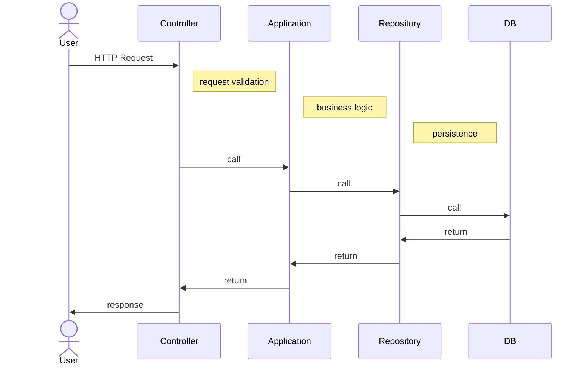

# Architecture

```mermaid
sequenceDiagram
   actor U as User
   participant C as Controller
   participant S as Application
   participant R as Repository
   participant DB
   U->>C: HTTP Request
       Note right of C: request validation
       Note right of S: business logic
       Note right of R: persistence
   C->>S: call
   S->>R: call
   R->>DB: call
   DB->>R: return
   R->>S: return
   S->>C: return
   C->>U: response
```

# Domain

Post:

- ID
- Title
- Description
- Body
- Date
- AuthorEmail
